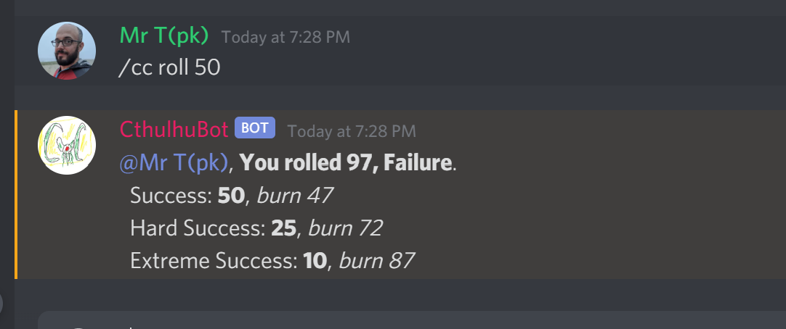
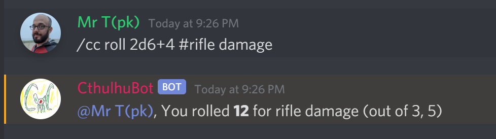

# coc-bot

A Discord Bot for the Call of Cthulhu TTRPG. Features include:

- Roll dice expressions and d100 ability rolls
- Prints success thresholds & luck-burn values to achieve higher success degrees

## Usage

[Join the Bot to your Server](https://discord.com/oauth2/authorize?client_id=805146614841999371&scope=bot)

****CthulhuBot Available Commands****

**Rolling**
General Form: \`/cc roll <attribute> <bonusOrPenalty> <label>\`

`/cc help`

### General Die Rolling

`/cc roll d6`

`/cc roll 2d8`

`/cc roll d6+2d8 #label`

`/cc roll 2d20kh1 #attack-with-advantage`

`/cc roll 2d20kl1 #attack-with-disadvantage`

### Call of Cthulhu Die Rolling

`/cc roll <attributeScore>`

`/cc roll <attributeScore>b<numBonus>`

`/cc roll <attributeScore>p<numPenalty>`

`/cc roll <attributeScore> #label`

e.g. `/cc roll 25b2 "handgun"` rolls against a skill with a value of 25 labeled "handgun" with 2 bonus dice
