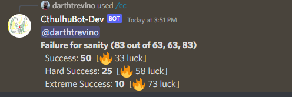

# coc-bot

A Discord Bot for the Call of Cthulhu TTRPG. Features include:

- Roll dice expressions and d100 ability rolls
- Prints success thresholds & luck-burn values to achieve higher success degrees

## Usage

[Join the Bot to your Server](https://discord.com/oauth2/authorize?client_id=805146614841999371&permissions=2147485696&scope=bot%20applications.commands)

****CthulhuBot Available Commands****

**Rolling**
General Form: \`/cc roll input:"<attribute> <bonusOrPenalty>" for: "label"\`

`/cc help`

## Call of Cthulhu Die Rolling

* `/cc roll input: "<attributeScore>"`
* `/cc roll input: "<attributeScore><b or p><numBonusOrPenalty>"`

Examples: 
* `/cc roll input: "25b2" for: "handgun with 2 bonus"`
* `/cc roll input: "39p2" for: "sanity with 2 penalty"`

## General Die Rolling

* `/cc roll input: "d6"`
* `/cc roll input: "d6+2d8" for: shotgun`
* `/cc roll input: "2d20kh1" for: "attack with advantage"`
* `/cc roll input: "2d20kl1" for: "attack with disadvantage"`
  
## Roll Label Shorthand

The roll label may be placed inside the input area: 

* `/cc roll input: "2d6 damage"`
* `/cc roll input: "40 sanity"`